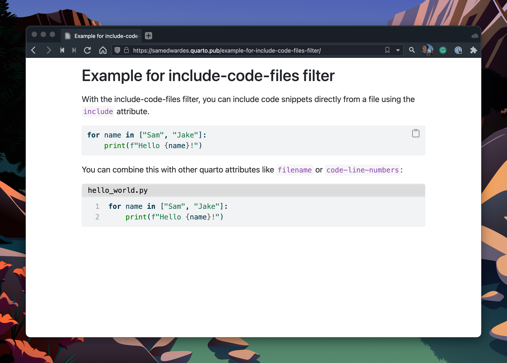

# include-code-files Extension For Quarto

## DO NOT USE

This extension has been deprecited in favour of using [b3/include-code-files](https://github.com/b3/include-code-files).

## README

Include code from files in code blocks.



Adapted from <https://github.com/pandoc/lua-filters/blob/master/include-code-files/include-code-files.lua> and written by [Bruno BEAUFILS](https://github.com/b3).


## Installing

```bash
quarto add SamEdwardes/include-code-files
```

This will install the extension under the `_extensions` subdirectory. You will want to check in this directory if you're using version control.

## Using

To use the include-code-files filter, add it to your documents YAML front matter:

```yaml
---
title: "My doc"
filters:
  - include-code-files
---
```

With the include-code-files filter, you can include code snippets directly from a file using `include`. For example, you may have a python script like this:

```python
# _snippets/hello_world.py
for name in ["Sam", "Jake"]:
    print(f"Hello {name}!")
```

To render this file in a code chunk, use the `include` attribute:

``````markdown
```{.python include="_snippets/hello_world.py"}
```
``````

You can combine this with other quarto attributes like `filename` or `code-line-numbers`:

``````markdown
```{.python include="_snippets/hello_world.py" filename="hello_world.py" code-line-numbers="true"}
```
``````

## Example

Here is the source code for a minimal example: [example.qmd](docs/example.qmd). See a rendered sample here: <https://samedwardes.quarto.pub/example-for-include-code-files-filter/>.
